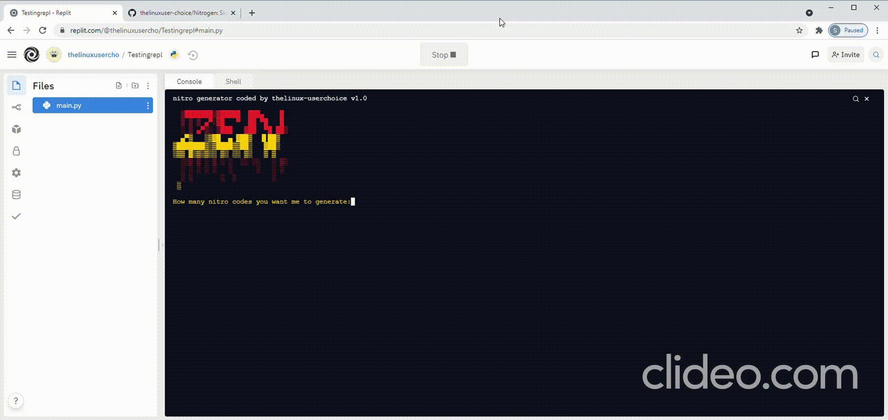

# Nitrogen
Simple nitro generator coded in python and can create 1000 nitro links in 2sec




## Git Installation
```
# clone the repo
$ git clone https://github.com/thelinuxuser-choice/Nitrogen
# change the working directory to Nitrogen
$ cd Nitrogen

```
## Usage

```
python3 nitrogen.py
```

## Support & Contributions
- Please ⭐️ this repository if this project helped you!
- Contributions of any kind welcome!
